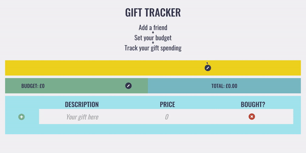

# [Appy-Wrapping](https://nelboh.github.io/gift-tracker-app/?v)  
  
An application created by a collaboration between four cohort members of the Develop Me bootcamp. We were given 5 days to complete an application of our choosing that used both a front-end and back-end. This application stores a list of gifts, their price, and a “bought” boolean in the backend, as well as the name of the friend the user is buying gifts for and the budget. The React front-end allows the users to interact with the database. The backend is hosted on AWS whilst the frontend was deployed on Github pages.

## How to Use [Appy-Wrapping](https://nelboh.github.io/gift-tracker-app/?v)
Go onto the [webiste](https://nelboh.github.io/gift-tracker-app/?v) and set your friend's name, and the budget you have to spend on them. Write the name of a gift and how much it costs. Press the green plus button to add it to the list. Once you buy the present, click on the red cross on the right, and it will turn into a tick, making it easy for you to track which presents have been bought and which haven't. If you run over the budget the total cost will turn red, letting you know that you have some hard choices ahead, but don't worry, because you can modify and delete your entries.  

# Restful API: Appy Wrapping Christmas Shopping List App

- [Restful API: Christmas Shopping List](#restful-api-christmas-shopping-list)
- [Gifts](#gifts)
  - [GET all gifts](#get-all-gifts)
  - [POST a gift](#post-a-gift)
  - [PATCH a gift](#patch-a-gift)
  - [DELETE a gift](#delete-a-gift)
- [Friend](#friend)
  - [GET all Friends](#get-all-friends)
  - [GET a specific friend](#get-a-specific-friend)
  - [GET all gifts belonging to one friend](#get-all-gifts-belonging-to-one-friend)
  - [POST a friend](#post-a-friend)
  - [PATCH a friend](#patch-a-friend)
  - [DELETE a friend](#delete-a-friend)

# Gifts
## GET all gifts
To GET all the gifts available use:
`https://appy-wrapping.developme.space/api/gifts`

This should return for each gift:
- id
- item_name 
- price
- bought
  

## POST a gift
To POST a gift use:
`https://appy-wrapping.developme.space/api/gifts`

You need to pass:
- item_name (string)
- price (number)
  

## PATCH a gift
To PATCH a gift use:
`https://appy-wrapping.developme.space/api/gifts/{giftID}`

You need to pass:
- item_name (string)
- price (number)
  

## DELETE a gift
To DELETE a gift use:
`https://appy-wrapping.developme.space/api/gifts/{giftID}`

You will receive a 204 when successfully deleted.
   

# Friend
## GET all Friends
To GET all the friends available use:
`https://appy-wrapping.developme.space/api/friends`

This should return for each friend:
-id
-name
-budget
  

## GET a specific friend
To GET a specific friend use:
`https://appy-wrapping.developme.space/api/friends/{friend_id}`

This shoudl return for each friend:
-id
-name
-budget
  

## GET all gifts belonging to one friend
to GET all the gifts belonging to a specific friend use;
`https://appy-wrapping.developme.space/api/friends/{friend_id}/gifts`

This should return for each gift:
-id
-item_name
-price
-bought
  

## POST a friend
To POST a gift use:
`https://appy-wrapping.developme.space/api/friends`

You need to pass:
- name (string)
- budget (number)
  

## PATCH a friend
To PATCH a friend use:
`https://appy-wrapping.developme.space/api/friends/{friendID}`

You need to pass:
- name (string)
- budget (number)
  

## DELETE a friend
To DELETE a friend use:
`https://appy-wrapping.developme.space/api/friend/{friendID}`

You will receive a 204 when successfully deleted.
